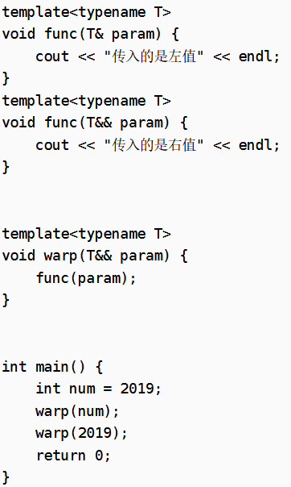
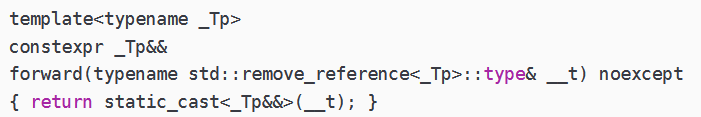
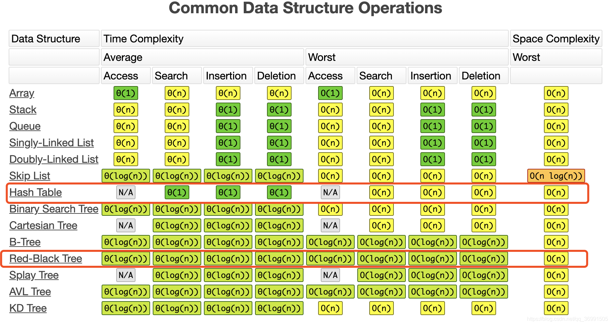

### 智能指针
#### shared_ptr
头文件：memory  
原理：shared_ptr < A > pb(new A);  
   shared_ptr < A > pb2 = pb;  
引用计数机制：多个用户用同一个对象，当count=0时再释放内存。  
auto sp1 = make_shared<int>(100); // 优先使用make_shared来构造智能指针  
API: pb.use_count(); .reset();参数为空，释放内存，参数不为空，分配内存。shared_ptr对象每次离开作用域时会自动调用析构函数，而析构函数并不像其他类的析构函数一样，而是在释放内存是先判断引用计数器是否为0。等于0才做delete操作，否则只对引用计数器左减一操作。    
注意避免循环引用，shared_ptr的一个最大的陷阱是循环引用，循环，循环引用会导致堆内存无法正确释放，导致内存泄漏。  
与普通指针相比：  
1、缺少 ++, – – 和 [] 运算符

与普通指针相比，shared_ptr仅提供-> 、*和==运算符，没有+、-、++、--、[]等运算符。
2、NULL检测

当我们创建 shared_ptr 对象而不分配任何值时，它就是空的；普通指针不分配空间的时候相当于一个野指针，指向垃圾空间，且无法判断指向的是否是有用数据。  
问题：是不是线程安全的？  
引用计数本身是安全的，多线程下赋值几次，值就加几次。原子变量的“happens-before”设置，可以线程安全地检查引用计数降为 0，然后可以毫无顾及地释放内存：

    当强引用计数降为 0，则可以释放无锁地资源内存。
    当弱引用计数和强引用计数都降为 0，则可以无锁地释放引用计数的内存。所以，引用计数的加减、引用计数内存释放、资源释放都是线程安全的。
所以sp的引用计数，加减都是线程安全的。其管理的资源都可以线程安全地释放。   
但是只保证能够线程安全地管理资源的生命期，不保证其资源可以线程安全地被访问。       
不安全在不同线程用引用传递，公用一个智能指针，其内部资源不是线程安全的。  
 
boost官方文档中有如下结论：

1）同一个shared_ptr被多个线程“读”是安全的；

2）同一个shared_ptr被多个线程“写”是不安全的；

3）共享引用计数的不同的shared_ptr被多个线程”写“ 是安全的；
#### unique_ptr
① 调用make_unique<type>(value)在定义进行赋值；

② 与shared_ptr和auto_ptr一样，可以使用调用new/new[]返回的指针去初始化unique_ptr指针；  
unique_ptr强调在整个作用域中的唯一性，也就是说“在其作用域内，有且仅有一个指针去维护这片堆区内存空间”  

因为我们将ptr指针初始化unique_ptr指针后，结果变成了unique_ptr指针与ptr指针共同维护ptr指向的堆区内存空间，此时，就会发现一个重要的问题缺陷“ptr再赋值给unique_ptr指针后也可以初始化其它类型的指针”，这严重违背了“unique_ptr指针在其作用域中的唯一性”。  
导致sp结束后内存重复释放。  
reset成员函数与shared_ptr的reset成员函数相同之处在于：都是改变指针指向的内存空间，但是不一样的是：由于只有一个unique_ptr指针指向这片在堆区开辟的内存区域，因此当指针指向其他内存空间时，这片原来的内存空间会被释放掉。因此，我常常称“unique_ptr指针的reset函数拥有的功能”为“指针的破坏功能，即传说中的损人利己”。  
up所有权的转移：  
```c++
unique_ptr<int> ptr(new int(10));
cout<< ptr.get();
auto ptr_new = std::move<unique_ptr<int>& >(ptr);
cout << (ptr==nullptr);
```

移动语义的结果就是把一个unique_ptr中存储的地址转移至另一个unique_ptr指针中去，并且把源unique_ptr类型的指针置空(=nullptr)。这样做比较安全，但是我们使用指针前一定要检查以下指针是否非空以防万一。  
#### weak_ptr 
是一种不控制对象生命周期的智能指针。  
std::weak_ptr 是一种智能指针，它对被 std::shared_ptr 管理的对象存在非拥有性（“弱”）引用。在访问所引用的对象前必须先转换为 std::shared_ptr。  

std::weak_ptr 用来表达临时所有权的概念：当某个对象只有存在时才需要被访问，而且随时可能被他人删除时，可以使用 std::weak_ptr 来跟踪该对象。需要获得临时所有权时，则将其转换为 std::shared_ptr，此时如果原来的 std::shared_ptr 被销毁，则该对象的生命期将被延长至这个临时的 std::shared_ptr 同样被销毁为止。
wp不能直接操作成员或方法，需要 auto sh_ptr = wp.lock();  
weak_ptr虽然是一个模板类，但是不能用来直接定义指向原始指针的对象。  
weak_ptr接受shared_ptr类型的变量赋值，但是反过来是行不通的，需要使用lock函数。  
weak_ptr设计之初就是为了服务于shared_ptr的，所以不增加引用计数就是它的核心功能。  
由于不知道什么之后weak_ptr所指向的对象就会被析构掉，所以使用之前请先使用expired函数检测一下。  

### 右值引用相关  
本质上是为了减少拷贝。  
右值引用构造函数代码示例：
```c++
class A
{
public:
    A() :m_ptr(new int(0)) {
        cout << "constructor A"  << endl;
    }

    A(const A& a) :m_ptr(new int(*a.m_ptr)) {
        cout << "copy constructor A"  << endl;
    }

    A(A&& a) :m_ptr(a.m_ptr) {
        a.m_ptr = nullptr; //置空防止重复析构
        cout << "move  constructor A"  << endl;
    }

    ~A(){
        cout << "destructor A, m_ptr:" << m_ptr  << endl;
        if(m_ptr)
            delete m_ptr;
    }

private:
    int* m_ptr;
};
A Get(bool a){A res;if(!a) return res;}
```
这样就可以在main函数中通过右值引用拷贝构造函数去获得将亡值A a(Get(false));  
move把左值（能赋值的）变成右值（临时的），包括纯右值：  
非引用返回的临时变量、运算表达式产生的临时变量、原始字面量 和lambda 表达式  
和将亡值：  
与右值引用相关的表达式，比如，T&& 类型函数的返回值、 std::move 的返回值  
#### 模板与万能引用  
当使用模板时，左值右值都只能走 &&  万能引用不是一种引用类型，而是代表要么是左值引用要么是右值引用。
1、万能引用用在需要推断类型的场合
如auto&& dog = dog1; 
template <typename T>  
void Test(T &&){}  
老版本c++，是没有右值引用这个概念的，故也没有万能引用的概念，如果我要实现技能接收左值又能接收右值，需要用const重载. 
注意右值引用本身是一个左值！  
#### 引用折叠
引用折叠（Reference Collapse）

万能引用说完了，接着来聊引用折叠（Reference Collapse），因为完美转发（Perfect Forwarding）的概念涉及引用折叠。一个模板函数，根据定义的形参和传入的实参的类型，我们可以有下面四中组合：

    左值-左值 T& & # 函数定义的形参类型是左值引用，传入的实参是左值引用
    左值-右值 T& && # 函数定义的形参类型是左值引用，传入的实参是右值引用
    右值-左值 T&& & # 函数定义的形参类型是右值引用，传入的实参是左值引用
    右值-右值 T&& && # 函数定义的形参类型是右值引用，传入的实参是右值引用

但是C++中不允许对引用再进行引用，对于上述情况的处理有如下的规则：
所有的折叠引用最终都代表一个引用，要么是左值引用，要么是右值引用。规则是：如果任一引用为左值引用，则结果为左值引用。否则（即两个都是右值引用），结果为右值引用。
#### forward完美转发

实际上上面两个都是调用了func函数的左值。因为warp(2019)后param是右值引用，但右值引用是一个左值，所以调用func的左值。  
```c++
template <typename T>
void warp(T&& param){
    func(std::forward<T> (param));
}
```
forward让类型不变，运行时把param由左值转化为右值。  
源码：  
  
先获得类型type，定义_t为左值引用的左值变量，通过static_cast进行强制转换。_Tp&&会发生引用折叠，当_Tp推导为左值引用，则折叠为_Tp& &&，即_Tp&，推导为右值引用，则为本身_Tp&&,所以froward返回值与static_cast处都为_Tp&&。  
所以在万能引用时进行使用。  
配合万能引用来使用的理由是借助万能引用的模板参数推导来告诉编译器，我传进来的是个左值还是右值？
而函数的入参，一定是一个左值（包括右值引用，因为它也是左值），然后推导出来的模板参数类型在引用折叠以后作为强转目标类型（保持实际入参的左右值属性：告诉编译器虽然是个左值，请一定要把我和实际入参一样对待），往下一层传递，这个过程应该是没有任何构造和析构的，也就是在没有任何性能损耗的情况下保持住了传参的左右值属性，说白了做的工作是给编译器看的。  
STL中的emplace_back采用&&右值引用给容器加东西。    
插入：红黑树>哈希，比哈希快，但查询没有哈希快。 原理：
哈希表将键值变为数组的下标，而将下标对应的值变为键值对的值，这样的话就可以通过下标的方式来获取对应的值，因此其查找速度非常快。
那么key值是如何变为哈希表的下标的呢？这里就要用到散列函数，通过散列函数将key值变为数组的下标。
最常用的构造散列函数的方法是除留余数法。 处理冲突和溢出是哈希技术中的两个重要问题。一般有开放地址法、链地址法。
链地址法：将所有关键字为同义词的记录存储在一个单链表中，这种链表叫做同义词子表，使用除留余数法，就不存在冲突的问题了，只是在链表中增加一个结点。  



### lambda函数
```c++
auto Add = [](int a, int b) -> int {
        return a + b;
    };
```
【   捕获列表 】( 参数列表,形参 ) 函数修饰选项 -> 返回值类型 {函数体};
捕获列表精细控制了lambda表达式能够访问的外部变量，以及如何访问这些变量。当lambda在类中使用时，可以使用[this]捕获当前类中的this指针，此时lambda获得了与成员函数同样的权限
如[ &c,&d ],[ this ]
lambda在使用拷贝捕获后修改外部变量时，需要添加mutable来修饰  
其实输出下lambda的typeinfo即可发现，这东西的本质还是一个class  
auto gLambda = []{};  
int main(int argc, char* argv[]) {  
auto lambda = []{};  
PrintType(lambda, gLambda);  
}  
将lambda想象成一个匿名类，它捕获列表中的任何外部变量最终会变为该类的成员变量，而在看似以函数形式调用lambda时使用的operator()在c++标准下受到了const修饰，不能修改成员变量，要解决这个问题，需要在lambda后添加修饰

lambda相互之间无法赋值，但是可以利用已有的lambda来初始化其他的lambda  


 


 